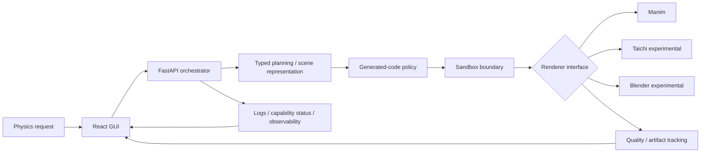

# Physics Foundry

**Local-first scientific-media orchestration for physics animation.**

Physics Foundry is an engineering prototype for turning bounded physics requests into structured plans, generated renderer code, observable jobs, reviewable artifacts, and quality-analysis results. The project is deliberately evidence-first: UI fixtures are labeled as fixtures, missing capabilities fail explicitly, and generated code is never allowed to silently fall back to direct host execution.

> **Status: active prototype.** The architecture and orchestration semantics are real; a retained real prompt → generated Manim → sandbox → MP4 → measured-QA reference run is the next evidence milestone in [issue #17](../../issues/17).

## Why this project is interesting

Physics Foundry is less about “AI makes a video” and more about the systems problem underneath it:

- **Typed orchestration:** explicit request, status, log, worker, artifact, and terminal-state models.
- **Evidence-aware execution:** `complete`, `fixture_complete`, `unsupported`, and `error` have different meanings.
- **Generated-code boundaries:** AST/path policy plus a sandbox wrapper that refuses unsandboxed fallback.
- **Capability-driven UI:** pipeline and system panels read backend state instead of manufacturing fake progress or hardware telemetry.
- **Renderer abstraction:** Manim, Taichi, and Blender-oriented interfaces can evolve independently.
- **Inspectable QA:** synthetic QA used for the interface is deterministic and labeled as demo data rather than presented as measured output.

## Current evidence

| Area | Current state |
| --- | --- |
| React/Vite GUI | implemented prototype under `apps/gui/` |
| FastAPI orchestration service | implemented |
| REST + WebSocket job/status paths | implemented |
| Dependency/capability reporting | implemented + dependency-light tests |
| Deterministic fixture planning | implemented + distinct `fixture_complete` state |
| GUI pipeline monitor | backend-driven, no client-side fake completion |
| GUI system monitor | backend-driven, no randomized CPU/GPU/model readiness |
| Generated-code static policy | implemented + contract tests |
| Direct host fallback | removed by design |
| Firejail execution wrapper | implemented; hostile/runtime isolation verification still pending |
| Real prompt → Manim → MP4 → measured QA | **not yet established** |
| Autonomous production-ready multi-engine generation | **not claimed** |

The detailed claim boundary lives in [`docs/CLAIMS.md`](docs/CLAIMS.md). Implementation status is tracked in [`docs/IMPLEMENTATION_STATUS.md`](docs/IMPLEMENTATION_STATUS.md).

## Architecture



The key design choice is separation. Planning does not need to know how rendering is implemented; rendering does not get to redefine success semantics; the GUI does not infer capability from decorative state.

## Failure semantics

Physics Foundry uses explicit terminal meanings:

| State | Meaning |
| --- | --- |
| `complete` | a real supported operation completed |
| `fixture_complete` | deterministic orchestration fixture completed; **no rendered-media claim** |
| `unsupported` | the required real capability is unavailable or not wired |
| `error` | a supported operation was attempted and failed |

That distinction replaced earlier prototype behavior that could simulate work and eventually report success.

## Generated-code boundary

Generated renderer code is treated as untrusted input.

Static validation currently rejects disallowed imports/calls, relative imports, dynamic execution patterns, shell-like execution, absolute staging paths, and parent-path traversal. Those checks are defense-in-depth, not a security boundary by themselves.

Real execution currently requires the supported **Firejail** path. If the isolation backend is unavailable, execution returns `unsupported` instead of running generated Python or Blender code directly on the host. `nsjail` may be detected as installed, but it is not currently treated as a verified execution backend.

Runtime adversarial isolation remains an explicit open verification task in [issue #27](../../issues/27) and [`SECURITY.md`](SECURITY.md).

## Quick start

### GUI

```bash
git clone https://github.com/ddelucchi/physics-video-genera.git
cd physics-video-genera
npm install
npm run dev:gui
```

The canonical frontend lives in `apps/gui/`. The repository root is a workspace coordinator, not a second application.

### Orchestrator API

Python 3.11 is the reference interpreter.

```bash
cd apps/orchestrator
python -m pip install -e .
python -m uvicorn orchestrator.main:app --reload --port 8000
```

Useful endpoints:

```text
GET  /health
GET  /status
GET  /capabilities
GET  /metrics
POST /api/pipeline/create
GET  /api/pipeline/{pipeline_id}/status
```

The GUI defaults to `http://127.0.0.1:8000` and can be pointed elsewhere with `VITE_ORCHESTRATOR_URL`.

## Dependency-light verification

The portfolio contract intentionally avoids requiring a GPU, local LLM, renderer stack, or Firejail runtime.

```bash
python -m pip install "pydantic>=2.5,<3" "pytest>=7.4,<9" "pytest-asyncio>=0.21,<1"
PYTHONPATH=apps/orchestrator pytest -q \
  apps/orchestrator/tests/test_portfolio_contract.py \
  apps/orchestrator/tests/test_sandbox_runtime_contract.py
```

These tests cover fixture semantics, capability reporting, Pydantic model isolation, generated-code policy, path traversal rejection, and the invariant that unavailable/unverified sandbox paths do **not** fall back to host execution.

See [`docs/REPRODUCIBILITY.md`](docs/REPRODUCIBILITY.md) for the evidence ladder.

## Demo, fixture, and live data

The UI uses three provenance categories:

- **Demo:** deterministic synthetic values used to exercise presentation behavior.
- **Fixture:** deterministic backend values used to exercise orchestration semantics.
- **Live:** values returned by an actual service, renderer, analyzer, or measurement path.

The application shell labels the prototype/demo boundary. Pipeline and system monitoring now query the orchestrator rather than generating pretend telemetry in the browser.

## Repository map

```text
physics-video-genera/
├── apps/
│   ├── gui/                  # canonical React/Vite interface
│   └── orchestrator/         # FastAPI service + execution/QA boundaries
├── packages/                 # shared/plugin-oriented packages
├── config/                   # runtime / renderer configuration
├── docs/
│   ├── CLAIMS.md             # public claim ledger
│   ├── IMPLEMENTATION_STATUS.md
│   ├── PORTFOLIO_ROADMAP.md
│   ├── PRD.md                # product vision, not current capability claim
│   └── REPRODUCIBILITY.md
├── scripts/
├── SECURITY.md
└── CONTRIBUTING.md
```

## Next proof milestone

The highest-value next step is intentionally narrow:

```text
bounded prompt
    ↓
schema-valid scene plan
    ↓
generated Manim source persisted before execution
    ↓
sandboxed renderer invocation
    ↓
non-empty MP4
    ↓
real quality measurement
    ↓
retained plan + source + command + logs + artifact + QA
```

Once that chain is reproducible from a clean checkout, it becomes the reference portfolio artifact. Additional renderer breadth comes after that proof, not before it.

## Public claim rule

A capability is promoted only when the evidence matches the wording. Interfaces, TODOs, installed binaries, architecture diagrams, fixture values, randomized/synthetic output, and planned integrations are not treated as proof of end-to-end behavior.

That constraint is intentional. A smaller verified system is more valuable than a larger imaginary one.

## License

MIT. See [`LICENSE`](LICENSE).
